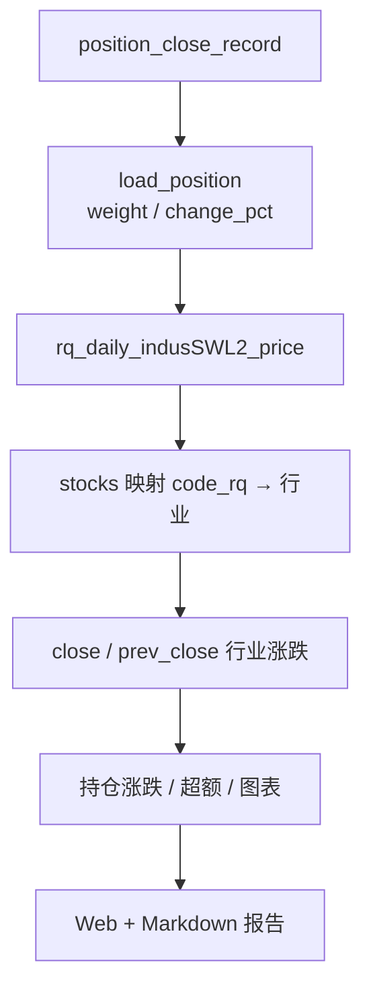

# 日频持仓分析 — 取数、计算与比较说明

本文档说明 **DailyReport** 日度持仓分析报告的数据来源、取数方式、指标计算公式，以及如何与 **申万二级行业指数**（`rq_daily_indusSWL2_price`）进行比较。  
实现代码位于 `DailyReport/position_daily/services/`，数据表结构详见根目录 [`date.md`](../date.md)。

> 当前版本包含：**申万二级（RQ）** + **Wind 扩展分析**（估值、资金流、一致预期、中信行业、主题、宽基风格、单票贡献）

---

## 1. 分析目标与报告结构

| 模块 | 问题 | 数据源 |
|------|------|--------|
| 账户概览 | 今天整体涨多少、盈亏多少 | 持仓快照 `position_close_record` |
| 申万二级 | 行业权重如何、相对行业超多少 | `rq_daily_indusSWL2_price` |
| 估值暴露 | 组合偏贵还是偏便宜 | Wind `ASHAREEODDERIVATIVEINDICATOR` |
| 资金流向 | 超大单/大单是否在加仓 | Wind `ASHAREMONEYFLOW` |
| 盈利预期 | 是否偏高预期、覆盖度 | Wind `ASHARECONSENSUSROLLINGDATA` (FY1) |
| 中信行业 | 另一套行业权重与超额 | Wind `ASHAREINDUSTRIESCLASSCITICS` + `AINDEXINDUSTRIESEODCITICS` |
| 主题/概念 | 人工智能等主题集中度 | Wind `ASHAREWTHEMEINDUSTRIESCLASS` |
| 宽基风格 | 300/1000/大小盘暴露 | `rq_base_index` + Wind `AINDEXEODPRICES` |
| 单票贡献 | 今天谁拖后腿 | 持仓快照自身 |

输出形式：

- **Web 页面**：`http://127.0.0.1:8000/?date=YYYY-MM-DD`
- **Markdown**：`reports/daily/DBZQ_18931015/{date}.md`
- **缓存**：`reports/cache/{date}.pkl`（二次访问直接读缓存）

报告章节：

1. 账户概览  
2. 申万二级行业  
3. Wind 估值暴露  
4. Wind 资金流向  
5. Wind 盈利预期（FY1）  
6. 中信二级行业  
7. 主题/概念暴露  
8. 宽基风格（成分 + 市值大中小盘）  
9. 单票贡献 Top 15  
10. 数据质量  

---

## 2. 数据源与连接

### 2.1 MongoDB

| 用途 | URI | 库 | 集合 |
|------|-----|----|------|
| 持仓快照 | `192.168.110.199:27017` | `position_close_record` | `DBZQ_18931015` |
| RQ 日频 | `192.168.110.199:27018` | `basic_rq` | `rq_daily_indusSWL2_price`, `rq_base_index` |

连接账号（只读）：见 `position_daily/services/config.py`。

### 2.2 Wind MySQL

| 配置项 | 默认 | 说明 |
|--------|------|------|
| Host | `114.80.62.203` | 可通过环境变量 `WIND_MYSQL_HOST` 覆盖 |
| Port | `5306` | `WIND_MYSQL_PORT` |
| Database | `wind` | `WIND_MYSQL_DATABASE` |

实现：`wind_db.py`。快照日若无数据，各表自动回退到 `MAX(TRADE_DT/EST_DT) <= 快照日`。

**单位**：`S_VAL_MV` 为**万元**；报告展示「亿」= `S_VAL_MV / 10000`。

### 2.3 rq_daily_indusSWL2_price

| 字段 | 说明 |
|------|------|
| `date` | 交易日 |
| `indus_code` | 申万二级代码，如 `801102` |
| `name` | 行业名称 |
| `close` | 行业指数收盘价 |
| `stocks` | 成分股 code_rq 列表（字符串，需 `ast.literal_eval` 解析） |

### 2.4 取数示例（Python）

```python
from position_daily.services.mongo import rq_db
from position_daily.services.position import load_position

# 1) 持仓
pos_df, summary, meta = load_position("2026-06-11")

# 2) 申万二级（当日全量，再筛持仓 code_rq）
indus_rows = list(rq_db()["rq_daily_indusSWL2_price"].find(
    {"date": "2026-06-11"},
    {"_id": 0, "indus_code": 1, "name": 1, "close": 1, "stocks": 1},
))

# 3) 前一日 close（算行业涨跌）
prev_date = "2026-06-10"  # 由库内最近 < trade_date 的 date 自动取
prev_rows = list(rq_db()["rq_daily_indusSWL2_price"].find(
    {"date": prev_date},
    {"_id": 0, "indus_code": 1, "close": 1},
))
```

---

## 3. 持仓预处理

### 3.1 代码转换

Wind 格式 → 米筐格式（`codes.py`）：

| Wind | 米筐 code_rq |
|------|--------------|
| `600100.SH` | `600100.XSHG` |
| `301636.SZ` | `301636.XSHE` |

### 3.2 派生字段

```
weight = market_value / Σ(market_value)     # 占组合市值权重，0~1
```

### 3.3 单位约定（重要）

| 字段 | 来源 | 单位 | 示例 |
|------|------|------|------|
| `change_pct` | 持仓快照 | **百分数** | `-1.28` 表示 **−1.28%** |
| `profit` | 持仓快照 | **元** | 相对成本价的**累计**浮动盈亏 |
| 行业涨跌 | 自算 | **百分数** | `(close/pre_close - 1) × 100` |

> **常见误区**：`profit`（累计盈亏）与 `change_pct`（当日涨跌）不是同一概念。  
> 某行业「超额为正」但「盈亏为负」完全可能——今天涨得好，但历史成本仍高于现价。

---

## 4. 申万二级行业分析

实现：`industry_analysis.py`

### 4.1 取数流程

```
1. 取 trade_date 前一日 prev_date（从 rq_daily_indusSWL2_price 最近 date）
2. 读 trade_date 全行业文档，解析 stocks → code_rq 列表
3. 仅保留「在持仓内出现」的 code_rq，建立 股票 → 行业 映射
4. 行业涨跌 = 当日 close / 前一日 close − 1，再 × 100
5. 持仓与行业 join，按 indus_code 聚合
```

```python
import ast

codes = ast.literal_eval(row["stocks"])  # ['600100.XSHG', ...]
indus_pct = (close / prev_close - 1) * 100
```

### 4.2 行业聚合指标

对同一申万二级行业 `G` 内的持仓：

| 指标 | 公式 | 说明 |
|------|------|------|
| 只数 | `count(G)` | 持仓内该行业股票数 |
| 权重 | `Σ weight_i` | 占整个组合的权重 |
| **持仓涨跌** | `Σ(weight_i × change_pct_i) / Σ weight_i` | 行业内市值加权平均涨跌（%） |
| **行业涨跌** | `(close / prev_close − 1) × 100` | 申万二级行业指数涨跌（%） |
| **超额** | `持仓涨跌 − 行业涨跌` | 相对行业指数（%） |
| 盈亏 | `Σ profit_i` | 行业内累计浮动盈亏（元） |

> 「持仓涨跌」必须是**行业内归一化**后的加权平均，不能与组合贡献度 `Σ(weight × change_pct)` 混淆。

### 4.3 排名规则

| 榜单 | 排序 | 用途 |
|------|------|------|
| 权重 Top 20 | `weight` 降序 | 看重仓行业暴露 |
| **全部行业** | 默认 `weight` 降序，Web 可点击列头排序 | 表格可滚动，展示所有映射到的行业 |
| 表现最好 Top 5 | `excess_pct` 降序 | 今日相对行业最强 |
| 表现最差 Top 5 | `excess_pct` 升序 | 今日相对行业最弱 |

### 4.4 比较解读示例

2026-06-11 通信设备（801102）：

| 指标 | 值 |
|------|-----|
| 持仓涨跌 | −0.97% |
| 行业涨跌 | −2.09% |
| 超额 | +1.12% |

含义：持仓内的通信设备子集今日平均跌 0.97%，申万二级行业指数跌 2.09%，**跑赢行业 1.12 个百分点**。

---

## 5. 整体流程图



---

## 6. 缓存与刷新

| 操作 | URL / 命令 | 行为 |
|------|-----------|------|
| 普通访问 | `/?date=2026-06-11` | 优先读 `reports/cache/2026-06-11.pkl` |
| 强制重算 | `/?date=2026-06-11&refresh=1` | 重新计算并更新缓存 |
| 命令行 | `python manage.py run_daily_report 2026-06-11` | 生成 MD + 更新缓存 |

首次计算约 10–20 秒（含 Wind MySQL）；缓存命中约几十毫秒。

---

## 7. 数据质量检查

| 检查项 | 含义 |
|--------|------|
| 未映射申万二级 | 股票不在任何行业 `stocks` 列表，列入 Top 20 清单 |
| 行业 prev_trade_date | 行业涨跌使用的前收日期，应为 trade_date 上一交易日 |

---

## 8. 手工验证清单

1. **账户等权涨跌**：`position_summary.avg_change_pct` 与页面一致  
2. **单票 change_pct**：`(last_price / prev_close - 1) × 100` 与快照接近  
3. **行业持仓涨跌**：筛某行业股票，算 `SUM(weight×change_pct)/SUM(weight)`  
4. **行业涨跌**：`rq_daily_indusSWL2_price` 当日/前日 `close` 比值 × 100  
5. **累计 vs 当日盈亏**：`SUM(profit)` 与 `SUM(mv×change_pct/100)` 分别核对  

---

## 10. Wind 扩展分析（实现文件）

| 模块 | 文件 | 核心公式 |
|------|------|----------|
| 估值 | `wind_analysis.analyze_valuation` | 加权 PE/PB；市值分位 = 全 A 截面 rank 后按 weight 加权 |
| 资金流 | `wind_analysis.analyze_moneyflow` | 超大单净流入 = BUY_EXLARGE − SELL_EXLARGE；汇总持仓内金额 |
| 一致预期 | `wind_analysis.analyze_consensus` | ROLLING_TYPE=FY1；覆盖度 = 有预期数据的市值权重 |
| 中信行业 | `wind_analysis.analyze_citics_industry` | 与申万相同口径的持仓涨跌/超额；指数来自 `AINDEXINDUSTRIESEODCITICS` |
| 主题 | `wind_analysis.analyze_theme` | 单票可多主题，权重为暴露加总（可 >100%） |
| 宽基 | `style_analysis.analyze_style` | `rq_base_index` 分桶 + Wind 指数 `S_DQ_PCTCHANGE` |
| 单票 | `stock_contribution.analyze_stock_contribution` | 当日贡献 = `market_value × change_pct / 100` |

---

## 9. 相关文件索引

| 文件 | 内容 |
|------|------|
| [`date.md`](../date.md) | Mongo 表结构 |
| `position_daily/services/config.py` | Mongo / Wind 连接 |
| `position_daily/services/wind_db.py` | Wind 查询工具 |
| `position_daily/services/wind_analysis.py` | Wind 五类分析 |
| `position_daily/services/style_analysis.py` | 宽基 + 市值风格 |
| `position_daily/services/stock_contribution.py` | 单票贡献 |
| `position_daily/services/position.py` | 读持仓 |
| `position_daily/services/industry_analysis.py` | 申万行业分析 |
| `position_daily/services/report_builder.py` | 汇总、MD 渲染 |
| `position_daily/services/charts.py` | Plotly 图表 |
| `position_daily/services/cache.py` | 按日 pickle 缓存 |
