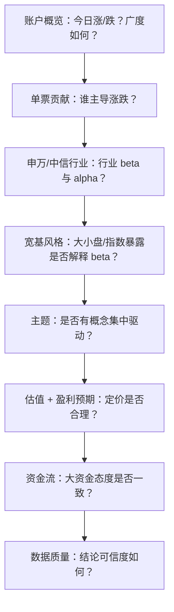

# 日度持仓报告 — 数据内容与结论解读

本文档说明 **DailyReport** 生成的日度持仓分析报告**包含哪些数据**、**各指标代表什么**，以及**如何据此得出投资分析结论**。

> 技术实现（取数 SQL、公式推导、数据源连接）见 [`分析计算说明.md`](分析计算说明.md)。

---

## 1. 报告是什么

系统在每个**持仓快照日**（如 `2026-06-18`）自动汇总一份报告，回答九类问题：

| 章节 | 核心问题 | 一句话结论用途 |
|------|----------|----------------|
| 账户概览 | 今天组合整体表现如何？ | 判断当日盈亏方向与广度 |
| 申万二级行业 | 行业配置是否合理？选股是否跑赢行业？ | 定位行业暴露与 alpha 来源 |
| 估值暴露 | 组合偏贵还是偏便宜？偏大还是偏小？ | 判断风格与估值风险 |
| 资金流向 | 大资金今天在买还是在卖？ | 辅助判断短期资金态度 |
| 盈利预期 | 分析师怎么看组合盈利？ | 判断预期支撑与覆盖质量 |
| 中信行业 | 另一套行业口径下表现如何？ | 交叉验证行业结论 |
| 主题/概念 | 主题集中度多高？ | 识别概念暴露与热点 |
| 宽基风格 | 300/1000/大小盘暴露如何？ | 判断 beta 与风格漂移 |
| 单票贡献 | 今天谁拉动、谁拖累？ | 归因当日涨跌 |

**输出位置：**

- Web：`http://127.0.0.1:8000/?date=YYYY-MM-DD`
- Markdown：`reports/daily/DBZQ_18931015/{date}.md`
- 缓存：`reports/cache/{date}.pkl`（二次访问秒开；`&refresh=1` 强制重算）

**生成流程（服务端日志顺序）：**

```
加载持仓 → 申万二级 → Wind 估值 → Wind 资金流 → Wind 一致预期
→ 中信行业 → 主题/概念 → 宽基风格 → 单票贡献 → Plotly 图表 → 写缓存
```

各 Wind 模块**独立运行**：某一模块失败（如宽基风格）不会阻断整份报告，其余章节仍正常展示。

---

## 2. 原始输入：持仓快照

所有分析都基于 MongoDB `position_close_record` 中策略 `DBZQ_18931015` 的**收盘持仓快照**。

每只股票的核心字段：

| 字段 | 含义 | 单位/格式 |
|------|------|-----------|
| `code` | Wind 代码，如 `600100.SH` | — |
| `name` | 股票名称 | — |
| `market_value` | 持仓市值 | 元 |
| `change_pct` | **当日**涨跌幅 | **百分数**（`-1.28` = −1.28%） |
| `profit` | **累计**浮动盈亏（相对成本） | 元 |
| `weight` | 占组合市值权重 | 0~1（系统派生） |

**重要区分：**

- `change_pct` 是**今天**涨跌；`profit` 是**历史累计**盈亏。
- 某行业「超额为正」但「盈亏为负」完全可能：今天跑赢行业，但成本仍高于现价。

---

## 3. 各章节数据与结论方法

### 3.1 账户概览

**展示数据：**

| 指标 | 来源 | 含义 |
|------|------|------|
| 持仓只数 | 快照 `position_summary.count` | 当日持有股票数量 |
| 股票市值 | `total_market_value` | 股票部分总市值 |
| 等权平均涨跌 | `avg_change_pct` | 各股涨跌幅**简单平均**（非市值加权） |
| 上涨/下跌/平盘 | `up_count` / `down_count` / `flat_count` | 涨跌家数分布 |
| 浮动盈亏 | `total_profit` | 全部持仓累计浮动盈亏之和 |

**如何得出结论：**

1. **当日方向**：等权平均涨跌 > 0 → 多数股票上涨；结合上涨家数占比看「广度」——若指数涨但下跌家数多，说明内部分化严重。
2. **盈亏 vs 涨跌**：浮动盈亏反映**持仓成本**；当日涨跌反映**今天**表现。两者应分开解读。
3. **与单票贡献交叉验证**：等权涨跌与市值加权收益可能不同；大权重股票的涨跌会主导实际市值变化（见 §3.9）。

---

### 3.2 申万二级行业

**展示数据（表格 + 权重/超额柱状图）：**

| 列 | 含义 |
|----|------|
| 代码 / 行业 | 申万二级行业代码与名称 |
| 只数 | 组合内该行业股票数 |
| 权重 | 该行业占组合总市值比例 |
| 持仓涨跌 | 行业内**市值加权**平均涨跌幅（%） |
| 行业涨跌 | 申万二级**行业指数**当日涨跌幅（%） |
| 超额 | 持仓涨跌 − 行业涨跌（%） |
| 盈亏 | 该行业内所有股票累计浮动盈亏（元） |

**数据来源：** MongoDB `rq_daily_indusSWL2_price`（行业成分 + 指数收盘价）。

**如何得出结论：**

| 观察 | 结论 |
|------|------|
| 权重 Top 行业 | 组合的**主要行业暴露**，决定 beta 方向 |
| 超额 > 0 且权重高 | **选股 alpha** 主要来源；今天在该行业跑赢指数 |
| 超额 < 0 且权重高 | 今天在该行业**跑输**；需排查重仓股 |
| 权重高 + 行业涨跌差 | 行业 beta 对组合当日收益的贡献方向 |
| 超额好但盈亏负 | 今天表现好，但历史成本仍高——**短期强、中期弱** |

**示例（通信设备 801102）：**

- 持仓涨跌 −0.97%，行业涨跌 −2.09%，超额 +1.12%
- **结论**：行业整体下跌，但组合内通信设备持仓平均跌得少，**相对行业跑赢 1.12 个百分点**。

**Top 5 最好/最差**：按超额排序，快速定位今日**相对行业**最强/最弱板块（需结合权重：小权重行业超额极端值参考意义有限）。

---

### 3.3 估值暴露

**展示数据：**

| 指标 | 含义 |
|------|------|
| 加权 PE(TTM) | 按持仓权重加权的滚动市盈率 |
| 加权 PB | 按持仓权重加权的市净率 |
| 加权市值（亿） | 按权重加权的平均总市值 |
| 加权市值分位 | 持仓在全 A 市值分布中的加权分位（0~100%） |

**数据来源：** Wind `ASHAREEODDERIVATIVEINDICATOR`（快照日若无数据则回退最近可用交易日）。

**如何得出结论：**

| 观察 | 结论 |
|------|------|
| PE/PB 明显高于历史或市场中枢 | 组合**估值偏贵**，对盈利增速要求更高 |
| 加权市值分位 > 70% | 偏向**大盘/高市值**风格 |
| 加权市值分位 < 30% | 偏向**小盘**风格 |
| 与 §3.8 市值风格对照 | 交叉验证大小盘暴露是否一致 |

> 估值是**静态截面**，不直接预测涨跌；需结合行业和盈利预期综合判断。

---

### 3.4 资金流向

**展示数据：**

| 指标 | 含义 |
|------|------|
| 超大单净流入 | 持仓股票超大单买入 − 卖出金额之和（元） |
| 大单净流入 | 大单买入 − 卖出金额之和（元） |
| 占组合市值 | 超大单净流入 / 组合总市值（%） |
| 今日方向 | 净流入 / 净流出 / 中性 |

**数据来源：** Wind `ASHAREMONEYFLOW`。

**如何得出结论：**

| 观察 | 结论 |
|------|------|
| 超大单净流入 > 0 且占市值比例较大 | 大资金**净买入**持仓标的，短期情绪偏积极 |
| 超大单净流出 | 大资金**净卖出**；若同时当日下跌，需关注是否持续 |
| 超大单与大单方向相反 | 机构（超大单）与较大资金（大单）分歧 |
| 与当日涨跌对照 | 资金流入 + 上涨 → 趋势可能延续；流入 + 下跌 → 可能有承接 |

> 资金流是**单日快照**，噪声较大，不宜单独作为交易信号，适合作为辅助验证。

---

### 3.5 盈利预期（FY1）

**展示数据：**

| 指标 | 含义 |
|------|------|
| 加权预期 PE | 按权重加权的 FY1 一致预期市盈率 |
| 加权预期净利润（亿） | 按权重加权的 FY1 一致预期净利润 |
| 预期净利润变化 | 相对上一预测日的净利润变化幅度（%） |
| 覆盖度 | 有一致预期数据的持仓**市值权重**占比 |

**数据来源：** Wind `ASHARECONSENSUSROLLINGDATA`（`ROLLING_TYPE=FY1`）。

**如何得出结论：**

| 观察 | 结论 |
|------|------|
| 覆盖度 > 80% | 预期指标**代表性强** |
| 覆盖度 < 50% | 大量持仓无分析师覆盖，预期 PE **参考价值下降** |
| 预期 PE << 实际 PE(TTM) | 市场预期盈利**快速增长** |
| 预期 PE >> 实际 PE(TTM) | 盈利可能**下滑**或预期偏保守 |
| 预期净利润变化 > 0 | 近期分析师**上调**盈利预期 |
| 与 §3.3 估值对照 | 高 PE + 高预期 PE → 成长定价；高 PE + 低预期 → 估值压力 |

---

### 3.6 中信二级行业

**展示数据：** 与申万二级**相同列结构**（权重、持仓涨跌、行业涨跌、超额、盈亏），但行业分类与指数来自 Wind 中信体系。

**数据来源：** Wind `ASHAREINDUSTRIESCLASSCITICS` + `AINDEXINDUSTRIESEODCITICS`。

**如何得出结论：**

- 与申万二级**对照阅读**：若两套口径下某方向（如科技、消费）权重都高，说明暴露**稳健**。
- 若申万与中信结论矛盾（如申万超额好、中信超额差），可能是**行业边界划分不同**或持仓集中在边界股票，需下钻到单票。
- 图表：权重 Top 15 柱状图 + 超额 Top/Bottom 10 柱状图，与申万章节用法相同。

---

### 3.7 主题/概念暴露

**展示数据：**

| 列 | 含义 |
|----|------|
| 主题 | Wind 主题/概念名称（如人工智能、新能源等） |
| 只数 | 属于该主题的持仓股票数 |
| 权重 | 该主题暴露权重（**可重复计入**） |
| 持仓涨跌 | 该主题内市值加权涨跌幅 |
| 盈亏 | 该主题内累计浮动盈亏 |

**特殊口径：** 一只股票可属**多个主题**，权重按主题分别加总，因此**所有主题权重之和可大于 100%**。

**如何得出结论：**

| 观察 | 结论 |
|------|------|
| 某主题权重 > 30% | 组合对该主题**高度暴露** |
| 最大主题（页面顶部提示） | 当前最核心的概念标签 |
| 主题 HHI（Herfindahl 指数，质量区） | 越高说明主题越集中 |
| 主题涨跌 vs 账户概览 | 判断今日涨跌是否由某概念驱动 |

---

### 3.8 宽基风格

**展示数据分两块：**

#### 8.1 指数成分板块

| 板块 | 含义 | 基准指数 |
|------|------|----------|
| 上证50 / 沪深300 / 中证500 / 中证1000 / 中证2000 | 按 `rq_base_index` 成分标记划分 | 对应 Wind 宽基指数 |
| 其他 | 不属于以上宽基成分 | 万得全 A |

每行含：权重、持仓涨跌、**指数涨跌**、**超额**（持仓涨跌 − 指数涨跌）。

#### 8.2 市值风格

按 Wind 总市值分为：

| 风格 | 阈值（Wind S_VAL_MV，万元） |
|------|------------------------------|
| 大盘 | ≥ 500 亿 |
| 中盘 | 100 亿 ~ 500 亿 |
| 小盘 | < 100 亿 |

**如何得出结论：**

| 观察 | 结论 |
|------|------|
| 300 权重高 + 300 超额正 | 大盘 beta 暴露且**跑赢**沪深300 |
| 1000/2000 权重高 | 偏小盘风格，波动可能更大 |
| 某板块超额持续为负 | 在该 beta 桶内**选股偏弱** |
| 成分板块 vs 市值风格 | 300 成分多但市值分位低 → 可能是 300 内偏小市值标的 |

> 若该章节显示「无数据」，请查看调试日志；常见原因为 `rq_base_index` 缺字段或 Wind 指数数据缺失。

---

### 3.9 单票贡献 Top 15

**展示数据：**

| 列 | 含义 |
|----|------|
| 权重 | 占组合市值比例 |
| 涨跌 | 当日涨跌幅（%） |
| 当日贡献 | `market_value × change_pct / 100`（元） |
| 贡献占比 | 当日贡献 / 组合总市值（%） |
| 累计盈亏 | 快照 `profit` 字段（元） |

**如何得出结论：**

| 观察 | 结论 |
|------|------|
| 贡献最大 Top 15 | 今日**拉动**组合上涨的主力 |
| 拖累最大 Top 15 | 今日**压制**组合表现的重仓或大跌股 |
| 贡献占比之和 ≈ 组合当日市值加权收益 | 可验证归因是否闭合 |
| 高权重 + 大负贡献 | **首要排查对象** |
| 大负贡献 + 累计盈亏仍正 | 今天回调，但历史仍盈利 |
| 与行业超额对照 | 拖累股是否集中在某行业，解释行业超额来源 |

**组合当日收益估算：**

```
当日市值加权收益率 ≈ Σ(weight × change_pct)  （change_pct 为百分数）
当日盈亏金额     ≈ Σ(market_value × change_pct / 100)
```

---

### 3.10 数据质量

**展示数据：**

| 检查项 | 含义 | 对结论的影响 |
|--------|------|--------------|
| 未映射申万二级 | 不在任何申万行业成分内的股票数及市值占比 | 占比高 → 行业分析**不完整** |
| 未映射中信二级 | 同上（中信口径） | 同上 |
| 各 Wind 数据日期 | 实际使用的 TRADE_DT / EST_DT | 若非快照日，结论对应**最近可用日** |
| 未映射股票 Top 20 | 具体无法归类的重仓股清单 | 优先人工补映射或单独分析 |

**使用原则：** 未映射市值占比 > 5% 时，行业/主题相关结论应**谨慎使用**，并优先查看未映射清单。

---

## 4. 综合分析框架

将各章节串联，可按以下顺序得出**当日复盘结论**：



### 4.1 归因模板（示例）

**场景：** 组合当日等权平均 −0.5%，市值加权约 −0.8%。

| 步骤 | 看什么 | 可能结论 |
|------|--------|----------|
| 1 | 单票拖累 Top | 2~3 只重仓股大跌，贡献 −0.6% |
| 2 | 申万行业 | 电子权重 25%，超额 −1.2% → 行业内有选股失误 |
| 3 | 宽基 | 1000 权重 40%，跑输中证1000 → 小盘 beta 拖累 |
| 4 | 资金流 | 超大单净流出 → 大资金同步减仓 |
| 5 | 数据质量 | 未映射 < 2% → 结论可信 |

**综合结论示例：** 今日下跌主要由电子行业重仓股跑输行业指数导致，小盘风格暴露放大跌幅，大资金呈净流出，与价格走势一致。

### 4.2 常见误读

| 误读 | 正确理解 |
|------|----------|
| 把累计盈亏当当日盈亏 | `profit` 是成本以来的浮动盈亏，不是今天赚的 |
| 把组合贡献度当行业内持仓涨跌 | 行业「持仓涨跌」是行业内重新归一化后的加权平均 |
| 主题权重相加 = 100% | 多主题重复计入，总和可 > 100% |
| 超额好 = 今天赚钱 | 超额是相对行业；行业大跌时超额好仍可能亏损 |
| 单日资金流 = 趋势 | 资金流需多日观察，单日噪声大 |
| 等权涨跌 = 市值加权收益 | 大权重股票主导实际市值变化 |

---

## 5. 图表说明

| 图表 | 内容 | 读法 |
|------|------|------|
| 申万行业权重 Top 15 | 水平柱状图 | 一眼看出**行业集中度** |
| 申万行业超额 Top/Bottom 10 | 正负柱状图 | 今日**相对行业**最强/最弱 |
| 中信行业权重 / 超额 | 同上 | 与申万交叉验证 |
| 主题权重 Top 15 | 水平柱状图 | **概念暴露**排名 |
| 宽基板块权重 | 柱状图 | 300/500/1000 等 **beta 结构** |

---

## 6. 与相关文档的关系

| 文档 | 用途 |
|------|------|
| **本文档** | 报告**读法**：有哪些数据、如何得出结论 |
| [`分析计算说明.md`](分析计算说明.md) | **算法**：取数 SQL、公式、缓存、验证清单 |
| [`date.md`](date.md) | Mongo / Wind **表结构** |

---

## 7. 快速查阅：指标 → 公式 → 结论

| 指标 | 计算要点 | 结论用途 |
|------|----------|----------|
| 权重 | 个股市值 / 组合总市值 | 暴露大小 |
| 持仓涨跌（行业/板块） | Σ(weight×change_pct) / Σweight | 该组内今日表现 |
| 行业/指数涨跌 | 指数收盘价或 Wind S_DQ_PCTCHANGE | 基准表现 |
| 超额 | 持仓涨跌 − 行业/指数涨跌 | **选股 alpha** |
| 当日贡献 | 市值 × change_pct / 100 | 对组合盈亏的**金额归因** |
| 贡献占比 | 当日贡献 / 组合总市值 | 对组合收益率的**百分点归因** |
| 加权 PE/PB | 按 weight 加权平均 | 估值水平 |
| 市值分位 | 全 A 截面 rank 后按 weight 加权 | 大小盘定位 |
| 超大单净流入 | BUY_EXLARGE − SELL_EXLARGE 汇总 | 大资金方向 |
| 预期 PE (FY1) | 一致预期按 weight 加权 |  forward 定价 |
| 主题权重 | 同股多主题重复加总 | 概念暴露（可 >100%） |

---

*文档版本与代码同步：策略 `DBZQ_18931015`，报告生成入口 `position_daily/services/report_builder.py`。*
